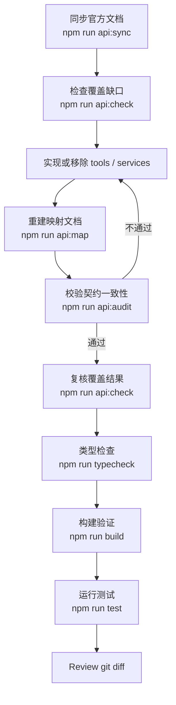

# AtomGit MCP Server


`@atomgit.com/atomgit-mcp-server` 将 [AtomGit](https://atomgit.com/) 平台能力接入支持 [Model Context Protocol (MCP)](https://modelcontextprotocol.io/) 的 AI 客户端，提供 286 个工具，覆盖仓库、PR、Issue、Actions、看板等 19 个功能分类。

## 目录

- [快速开始](#快速开始)
- [客户端配置](#客户端配置)
- [功能概览](#功能概览)
- [HTTP Transport](#http-transport)
- [MCP Resources 与 Prompts](#mcp-resources-与-prompts)
- [开发指南](#开发指南)
- [环境变量](#环境变量)
- [相关链接](#相关链接)
- [许可证](#许可证)

## 快速开始

### 前置要求

- [Node.js](https://nodejs.org/) `>= 18`
- [AtomGit](https://atomgit.com/) 账号
- AtomGit Personal Access Token

### 获取 Access Token

1. 登录 AtomGit。
2. 打开 [设置 → 访问令牌](https://atomgit.com/setting/token-classic)。
3. 创建 Personal Access Token，按需分配权限。
4. 保存生成的 Token。

### 运行

```bash
ATOMGIT_TOKEN=你的Token npx -y @atomgit.com/atomgit-mcp-server
```

### 安全模式

默认不暴露 `delete_*`、`remove_*`、`leave_*`、`archive_*`、`transfer_*` 等危险工具。需要时设置：

```bash
ATOMGIT_ENABLE_DANGEROUS_TOOLS=true npx -y @atomgit.com/atomgit-mcp-server
```

## 客户端配置

### AtomCode

[AtomCode](https://atomcode.atomgit.com/) 通过项目根目录 `.mcp.json`（或用户全局 `~/.atomcode/mcp.json`）接入：

```json
{
  "mcpServers": {
    "atomgit": {
      "command": "npx",
      "args": ["-y", "@atomgit.com/atomgit-mcp-server"],
      "env": {
        "ATOMGIT_TOKEN": "${ATOMGIT_TOKEN}",
        "ATOMGIT_ENABLE_DANGEROUS_TOOLS": "false"
      }
    }
  }
}
```

- 建议先将 Token 导出为环境变量，AtomCode 支持 `${VAR}` 与 `${VAR:-默认值}` 展开，避免 Token 写死在配置里。
- 项目级 `.mcp.json` 在项目被信任前不会自动拉起，使用 `/mcp trust` 信任当前项目，配置变更后 `/mcp reload` 重连。
- 接入后工具以 `mcp__atomgit__<工具名>` 形式注册，如 `mcp__atomgit__get_repository_tree`。
- 也可用命令行添加：`atomcode mcp add atomgit npx -y @atomgit.com/atomgit-mcp-server`

更多说明见 [AtomCode MCP 集成文档](https://atomcode.atomgit.com/docs/zh/index.html)。

### 其他客户端

Claude Desktop、Cursor、Cline 等均使用标准 MCP 配置格式，将 `command` 指向 `npx`（Windows 用 `npx.cmd`），`args` 为 `["-y", "@atomgit.com/atomgit-mcp-server"]`，`env` 中注入 `ATOMGIT_TOKEN` 即可。各客户端配置文件路径不同，参考对应文档。

## 功能概览

| 模块 | 能力 |
|------|------|
| 仓库管理 | 查询、创建、删除、Fork、Star、Watch、文件操作 |
| 分支与标签 | 分支管理、标签管理、受保护分支 |
| 提交与发布 | 提交历史查询、版本发布管理 |
| 合并请求 | PR 查询、创建、合并、Diff、评审 |
| 工单管理 | Issue 查询、创建、更新、评论、指派 |
| 项目规划 | Milestone 与 Label 管理 |
| 看板管理 | 组织看板与工作项管理 |
| 用户与组织 | 用户信息、SSH 密钥、组织成员 |
| 企业与成员 | 企业级资源和成员权限管理 |
| 搜索与 Webhook | 代码/仓库/用户搜索，Webhook 管理 |
| AIHub | AIHub 模型相关能力 |
| Actions | 工作流运行、Job、Artifact、Runner 管理 |

## HTTP Transport

默认使用 stdio transport。如需远程接入，设置 `ATOMGIT_TRANSPORT=http` 启动 Streamable HTTP 端点（兼容 SSE 流式响应），默认监听 `http://127.0.0.1:3000/mcp`：

```bash
ATOMGIT_TRANSPORT=http ATOMGIT_PORT=3000 node dist/index.js
```

远程客户端配置 url 指向 `http://<host>:3000/mcp` 即可。

> ⚠️ 安全说明
>
> - 服务器持有 `ATOMGIT_TOKEN`，当前无内置认证：能访问端口即可全权操作用户账号。
> - 默认绑定 `127.0.0.1`（仅本机），可通过 `ATOMGIT_HOST` 修改。
> - 如需暴露到公网，请自行加认证/反代/TLS，不要直接以 `0.0.0.0` 暴露。

## MCP Resources 与 Prompts

### Resources

| URI | 说明 | MIME |
|-----|------|------|
| `atomgit://user` | 当前认证用户信息 | `application/json` |

资源模板：

| URI 模板 | 说明 | MIME |
|----------|------|------|
| `atomgit://{owner}/{repo}` | 仓库信息 | `application/json` |
| `atomgit://{owner}/{repo}/readme` | 仓库 README 内容 | `text/markdown` |
| `atomgit://{owner}/{repo}/file/{path}` | 仓库内文件内容 | `text/plain` |
| `atomgit://{owner}/{repo}/commit/{sha}` | 指定提交详情 | `application/json` |
| `atomgit://{owner}/{repo}/issue/{number}` | 指定 Issue 详情 | `application/json` |
| `atomgit://{owner}/{repo}/pull/{number}` | 指定 Pull Request 详情 | `application/json` |

### Prompts

| 名称 | 说明 | 主要参数 |
|------|------|----------|
| `create-repository` | 创建新仓库 | name（必填）、description、private 等 |
| `create-issue` | 创建 Issue | owner、repo、title（必填）等 |
| `create-pull-request` | 创建 Pull Request | owner、repo、title、head、base（必填）等 |
| `review-code` | 评审 PR 或提交 | owner、repo、number 或 sha |
| `setup-ci` | 配置 CI/CD | owner、repo、workflowName |
| `manage-collaborators` | 管理协作者 | owner、repo、action（必填）等 |
| `search-code` | 搜索 | query（必填）、type、limit |
| `manage-issues` | 查看筛选 Issue | owner、repo、state、labels 等 |

## 开发指南

### 环境搭建

```bash
git clone https://atomgit.com/zkxw2008/AtomGit-MCP-Server.git
cd AtomGit-MCP-Server
npm install
cp .env.example .env  # 填入 ATOMGIT_TOKEN
```

### 本地联调

将 MCP 客户端配置中的 `command` 指向本地 `node`，`args` 指向 `dist/index.js`：

```json
{
  "mcpServers": {
    "atomgit-dev": {
      "command": "node",
      "args": ["/path/to/AtomGit-MCP-Server/dist/index.js"],
      "env": {
        "ATOMGIT_TOKEN": "你的Token",
        "ATOMGIT_ENABLE_DANGEROUS_TOOLS": "false"
      }
    }
  }
}
```

- Windows：`command` 用 `node.exe`（或绝对路径），`args` 路径反斜杠写成 `\\`。
- AtomCode：`env` 中用 `${ATOMGIT_TOKEN}` 引用环境变量，配置放入 `.mcp.json` 后执行 `/mcp trust` 和 `/mcp reload`。

### 常用命令

| 命令 | 说明 |
|------|------|
| `npm run dev` | `tsx` 直接运行源码 |
| `npm run build` | 编译 TypeScript → `dist/` |
| `npm run start` | 运行 `dist/index.js` |
| `npm run typecheck` | TypeScript 类型检查 |
| `npm run test` | 运行 Jest 测试 |
| `npm run clean` | 清理 `dist/` |
| `npm run api:sync` | 同步官方 API 文档 → `docs/apis_url.json` |
| `npm run api:check` | 检查 API 覆盖情况 |
| `npm run api:map` | 生成 `docs/api_tool_map.md` |
| `npm run api:audit` | 审计工具参数与官方文档一致性 |
| `npm run api:scaffold` | 为新 API 生成工具和服务骨架 |

### 维护流程

同步官方 API、补齐缺口或校准参数时，推荐按以下流程执行：



- `api:sync` 抓取 AtomGit 官网文档，过滤后得到 API 基线。
- `api:check` 对比基线，确认缺了什么、多了什么。
- 实现阶段只改 `src/services/`、`src/tools/`、必要的 `src/types/`。
- `api:audit` 发现问题时回到实现，通过后再继续。
- `api:scaffold` 可生成骨架，但分类命名与现有模块不一致时仍以手工实现为准。

### 项目结构

```text
AtomGit-MCP-Server/
├── src/
│   ├── core/        # 核心基础设施（ToolRegistry、SafetyPolicy 等）
│   ├── services/    # API 服务层
│   ├── tools/       # MCP 工具层
│   ├── types/       # 类型定义
│   └── index.ts     # 入口
├── scripts/         # 辅助脚本
├── docs/            # 文档与 API 映射
└── dist/            # 编译产物
```

## 环境变量

| 变量 | 默认值 | 说明 |
|------|--------|------|
| `ATOMGIT_TOKEN` | — | Personal Access Token（**必填**） |
| `ATOMGIT_ENABLE_DANGEROUS_TOOLS` | `false` | 开启危险工具（delete/remove/archive/transfer） |
| `ATOMGIT_API_BASE_URL` | `https://api.atomgit.com` | API 基础地址 |
| `ATOMGIT_TIMEOUT_MS` | 无限制 | HTTP 请求超时（毫秒） |
| `ATOMGIT_TRANSPORT` | `stdio` | 传输模式：`stdio` 或 `http` |
| `ATOMGIT_HOST` | `127.0.0.1` | HTTP 模式监听地址 |
| `ATOMGIT_PORT` | `3000` | HTTP 模式监听端口 |

## 相关链接

- npm: [@atomgit.com/atomgit-mcp-server](https://www.npmjs.com/package/@atomgit.com/atomgit-mcp-server)
- AtomGit: [zkxw2008/AtomGit-MCP-Server](https://atomgit.com/zkxw2008/AtomGit-MCP-Server)
- GitHub Mirror: [kylezhang/AtomGit-MCP-Server](https://github.com/kylezhang/AtomGit-MCP-Server)
- 开发规范: [AGENTS.md](./AGENTS.md)
- 发版流程: [RELEASE.md](./RELEASE.md)
- API 映射: [docs/api_tool_map.md](./docs/api_tool_map.md)

## 许可证

Apache 2.0 License